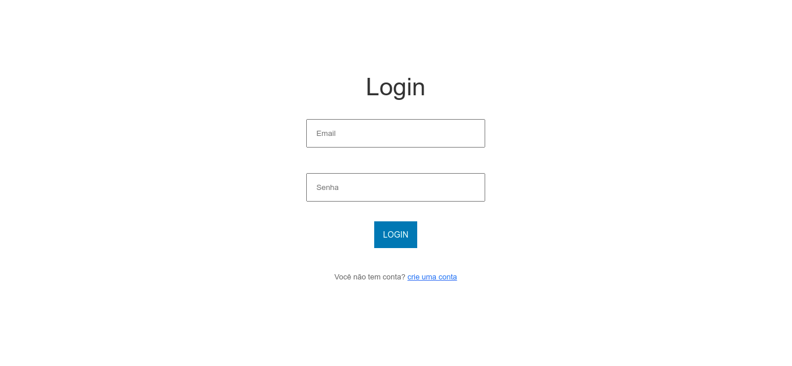

<h1 align="center">
    <a href="#/">Auth vue</a>
</h1>
<p align="center">🚀 acesse ao seu sistemas de forma rápida!!</p>
<p align="center">


</p>
<p align="center">


</p>

Índice
=================
<!--ts-->
* [Sobre](#sobre)
* [Screens](#screens)
* [Estrutura de pasta](#estrutura-de-pasta)
  * [Camadas da arquitetura](#camadas-da-arquitetura)
* [Instalação](#instalacao)
* [Como usar](#como-usar)
    * [Pre Requisitos](#pre-requisitos)
* [Tecnologias](#tecnologias)
* [Features](#features)
* [License](#license)
<!--te-->

## 🏁Sobre
Este aplicativo foi desenvolvido como objetivo de estudo das tecnologias vue.js e Firebase.

## :framed_picture: Screens
<p align="center">

</p>
## Estrutura de pastas
<pre>
Projeto/
├── app/
│   └── src
│       ├── router
│       ├── view
│       ├── components
│       └── assets
└── *
</pre>

### Camadas da arquitetura
pasta | camada | responsabilidade
------ | ------ | ------
router | view controller | caminhos para views
view | views | camada de visão
components | views | camada por agrupar todos pequenos components usados no sistema
assets | resources | camadas por agrupar recursos como css, img, fontes etc.


## 🧰 Instalação
Utilize esse comando para clonar o repositório:
```GIT
git clone https://github.com/gleissonneves/auth-vue
```
Caso não deseje clonar baixe o [código fonte](https://github.com/gleissonneves/auth-vue/archive/refs/heads/master.zip).

*Acesse ao diretório:*
```shell
cd auth-vue
```

*Instale as dependências:*
```shell
npm i ou npm update
```
*ou ainda*
```shell
yarn install ou yarn update
```

*inicie o servidor* 
```shell
npm run server
```
*ou configure uma porta específica*
```shell
npm run server --port 8080
```
## Como usar
  ### 🚧 Pre Requisitos 🚧

Antes de começar, você vai precisar ter instalado em sua máquina as seguintes ferramentas:
[Git](https://git-scm.com), [Vue.js CLI](https://cli.vuejs.org/).
Além disto é bom ter um editor para trabalhar com o código como [VSCode](https://code.visualstudio.com/)

## :computer: Tecnologias
* [Bootstrap](https://getbootstrap.com/)
* [Vue.js](https://cli.vuejs.org/)
* [Firebase](https://firebase.google.com/products/realtime-database/?utm_source=google&utm_medium=cpc&utm_campaign=latam-BR-all-pt-dr-SKWS-all-all-trial-e-dr-1009897-LUAC0008679&utm_content=text-ad-none-any-DEV_c-CRE_429626774316-ADGP_Hybrid%20%7C%20SKWS%20-%20EXA%20%7C%20Txt%20~%20Compute_Firebase-KWID_43700066431125567-kwd-312330826250&utm_term=KW_firebase-ST_Firebase&gclid=Cj0KCQjww4OMBhCUARIsAILndv53QxzZxOyALQKkh1yNRm1yyK81AhYARf8u5TUWr3QgkHXkjUNQTYQaAiIuEALw_wcB&gclsrc=aw.ds)

## :heavy_check_mark: Features

- [x] cadastro de usuário
- [x] Sing in/Sing out

## Licença
Este projeto esta sobe a licença MIT.

Feito com :heart: por Gleisson Neves 👋🏽
